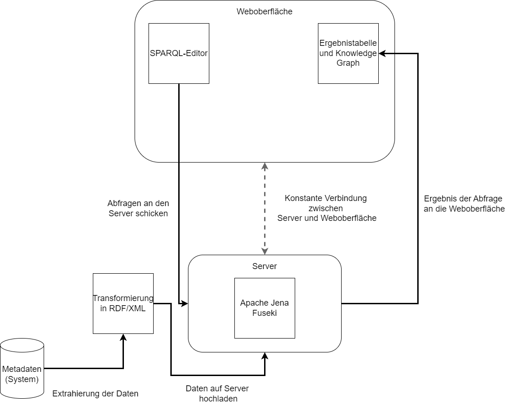
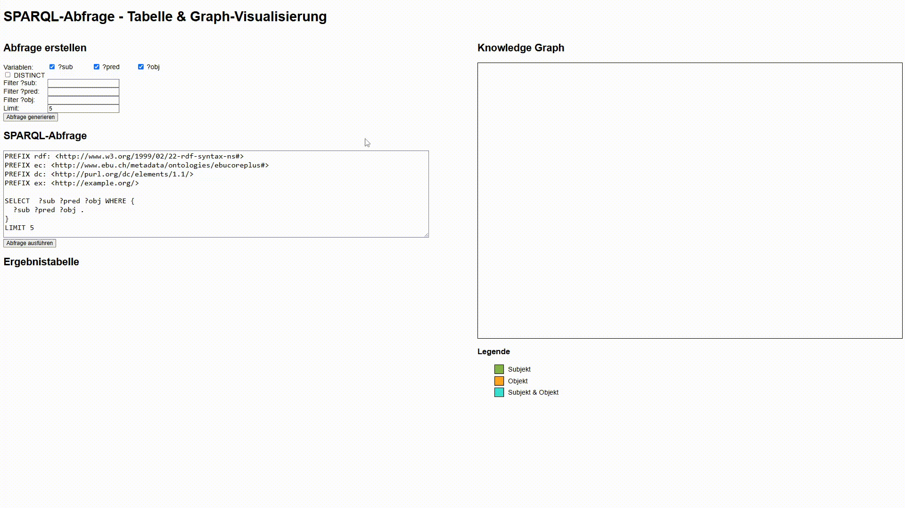
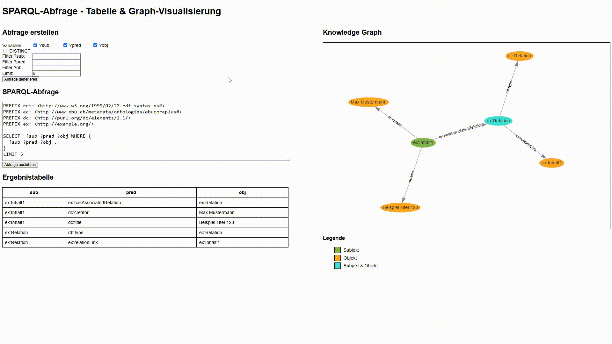

# NDR Metadaten Knowledge Graph

**Hinweis:** Der Quellcode und die Originaldaten sind aus Datenschutzgründen nicht öffentlich zugänglich. Dieses Repository dokumentiert die Architektur, Methodik und ausgewählte Ergebnisse.

## Problemstellung

Beim NDR lagen Metadaten aus verschiedenen Abteilungen im XML-Format vor – jedoch mit uneinheitlicher Benennung, z. B. `creator`, `ersteller` oder `author`, obwohl sie dieselbe Bedeutung hatten. Dies erschwerte die zentrale Verarbeitung, Suche und Visualisierung der Daten.

## Ziel

Ziel des Projekts war die semantische Vereinheitlichung dieser Metadaten mithilfe der Ontologie [EBUCorePlus](https://www.ebu.ch/metadata/ontologies/ebucore/). Die Daten wurden anschließend in RDF überführt, in einem Triple Store (Apache Fuseki) gespeichert und über eine Weboberfläche abfragbar und visuell analysierbar gemacht.

## Architektur

Ablauf:

1. XML-Daten extrahieren
2. Transformation in RDF unter Verwendung der EBUCorePlus-Ontologie
3. Speicherung im Apache Fuseki Triple Store
4. SPARQL-Abfragen über ein Webinterface via HTTP
5. Interaktive Visualisierung der Ergebnisse als Graph

## Ergebnisse

### Beispiel 1: Abfrage ausführen und Graph generieren

Durch einen Klick auf „Abfrage ausführen“ wird eine SPARQL-Anfrage an den Fuseki-Server geschickt. Das Ergebnis wird direkt als interaktiver Graph dargestellt.

### Beispiel 2: Dynamische Anpassung durch SPARQL

Die SPARQL-Abfrage wird verändert (z. B. durch Reduktion des `LIMIT`-Werts). Der resultierende Graph aktualisiert sich in Echtzeit und zeigt nur einen Teil der Daten.

## Verwendete Technologien

- RDF, SPARQL, Turtle
- Ontologie: EBUCorePlus
- Apache Jena Fuseki (Triple Store)
- HTML, CSS, JavaScript
- vis.js für die Visualisierung
